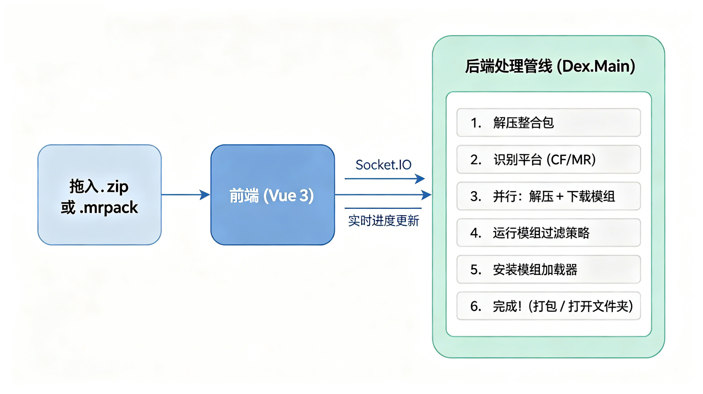

<div align="center">

<br/>


# DeEarthX V3

**一键将 Minecraft 整合包转换为可运行的服务端**

[English](README.en.md) | 简体中文

<br/>

[](https://github.com/xcclycs/DeEarthX-CE/releases)
[](https://github.com/xcclycs/DeEarthX-CE/blob/main/LICENSE)
[](https://github.com/xcclycs/DeEarthX-CE/commits/main)
[](https://github.com/xcclycs/DeEarthX-CE/issues)
[](https://github.com/xcclycs/DeEarthX-CE/pulls)

<br/>

<a href="https://qm.qq.com/q/REPt0kcuYu">
  
  加入Q群
</a>
&nbsp;&nbsp;·&nbsp;&nbsp;
<a href="https://www.bilibili.com/video/BV1xXwRzpEMh">
  
  宣传片
</a>

<br/><br/>

</div>

---

> [!WARNING]
> 模组可能过滤不干净，且制作的服务端**禁止用于售卖**！

---

## 项目概述

DeEarthX V3 是一个 **Windows 桌面应用**，帮你快速把客户端整合包转换成可运行的服务端。拖入整合包文件，选择模式，即可获得开箱即用的服务端——无需手动配置。

---

## 核心功能

<table>
<tr>
<td width="50%">

### 整合包支持

| 格式 | 状态 |
|------|------|
| CurseForge | ✅ |
| Modrinth | ✅ |
| MCBBS | ✅ |
| MultiMC Pack | ❌ |

</td>
<td width="50%">

### 模组加载器

| 加载器 | 状态 |
|--------|------|
| Forge | ✅ |
| NeoForge | ✅ |
| Fabric | ✅ |
| Quilt | ❌ |

</td>
</tr>
</table>

### 智能模组过滤

自动区分**客户端**和**服务端**模组，采用多策略多服少系统：

| 优先级 | 策略 | 说明 |
|--------|------|------|
| 平 | **Dexpub**（Galaxy Square） | 社区维护数据库，同时判定客户端与服务端模组 |
| 平 | **Hash + Modrinth** | 并行哈希匹配与 Modrinth API 查询 |
| 平 | **Mcmod** | 查询 mcmod.cn 获取模组分类 |
| 平 | **Mixin** | 对未判定模组进行 Mixin 配置分析 |

> 高优先级策略的判定结果**不可被低优先级策略覆盖**。

### 工作模式

| 模式 | 说明 |
|------|------|
| **开服模式** | 完整流程——下载服务端 jar、模组加载器，并过滤模组 |
| **上传模式** | 仅模组过滤——不下载服务端文件 |

### 镜像加速

内置国内下载镜像：

- **BMCLAPI** — 可配置（`on` / `off`）
- **MCIMirror** — 可配置（`on` / `off` / `partial`）

### 多语言

| 语言 | 代码 |
|------|------|
| 简体中文 | `zh-CN` |
| 繁體中文 (香港) | `zh-HK` |
| 繁體中文 (台灣) | `zh-TW` |
| English | `en-US` |

---

## 工作流程



---

## 技术架构

<table>
<tr>
<th>后端</th>
<th>前端</th>
<th>打包</th>
</tr>
<tr>
<td>

- C# (.NET 10)
- ASP.NET Core
- Socket.IO (自实现协议)
- Tomlyn (TOML 解析)
- 单文件发布 → `core.exe`

</td>
<td>

- Vue 3 (Composition API)
- TypeScript
- Tauri 2 (Rust)
- Ant Design Vue
- Tailwind CSS
- Vue I18n

</td>
<td>

- dotnet publish (后端发布)
- Tauri CLI (前端构建)
- Inno Setup 6 (安装包)
- UPX (EXE 压缩)

</td>
</tr>
</table>

---

## 项目结构

```
DeEarthX-CE/
├── backend-net/              # .NET 后端
│   ├── src/
│   │   ├── DeEarthX.Web/     # ASP.NET Core 入口 (端口 37019)
│   │   ├── DeEarthX.Core/    # 核心抽象与配置
│   │   ├── DeEarthX.Dearth/  # 模组过滤引擎
│   │   ├── DeEarthX.Dex/     # Dex 服务
│   │   ├── DeEarthX.Galaxy/  # Galaxy 服务
│   │   ├── DeEarthX.Guardian/# AI 崩溃检测 & 安全执行
│   │   ├── DeEarthX.Infrastructure/ # 基础设施 (下载/加密/Java/ZIP)
│   │   ├── DeEarthX.ModLoader/      # 模组加载器 (Forge/Fabric/NeoForge)
│   │   ├── DeEarthX.Platform/       # 平台适配 (CurseForge/Modrinth)
│   │   ├── DeEarthX.Plugins/        # 插件系统
│   │   ├── DeEarthX.Realtime/       # 实时通信 (Socket.IO)
│   │   └── DeEarthX.Templates/      # 模板管理
│   └── publish/              # 构建产物
├── front/                    # Tauri + Vue 前端
│   ├── src/                  # Vue 源码
│   ├── src-tauri/            # Rust/Tauri 源码
│   │   ├── installer/        # Inno Setup 脚本
│   │   └── binaries/         # 后端 EXE/DLL (构建时复制)
│   └── scripts/              # 构建脚本
├── IS6/                      # Inno Setup 6 编译器
├── .build/                   # 构建工具 (UPX 等)
├── b2f.js                    # 构建辅助脚本
└── package.json              # 根构建配置
```

---

## 安装说明

1. 从 [Releases](https://github.com/xcclycs/DeEarthX-CE/releases) 下载最新安装包
2. 运行安装程序
3. 启动 DeEarthX——即可使用

> **提示：** 建议不要安装在 C 盘，避免权限问题。

---

## 系统要求

| 要求 | 开服模式 | 上传模式 |
|------|:--------:|:--------:|
| Windows 操作系统 | ✅ | ✅ |
| Java 运行环境 | ✅ | ❌ |

**支持 Minecraft 版本：** 1.16.5 → 最新版

---

## 开发

### 环境要求

| 工具 | 版本 |
|------|------|
| .NET SDK | 10.0+ |
| Node.js | 24+ |
| pnpm | 9+ |
| Rust | stable |
| Inno Setup 6 | 内置于 `IS6/` |

### 开发命令

```bash
# 安装前端依赖
pnpm install

# 前端开发服务器（端口 9888）
cd front && pnpm run dev

# Tauri 开发模式（Vite + Tauri 窗口）
cd front && pnpm run tauri-dev

# 后端开发模式（端口 37019）
cd backend-net && dotnet run --project src/DeEarthX.Web
```

### 生产构建

```bash
# 完整构建（后端 → UPX → Tauri → Inno Setup → 安装包）
pnpm run build
```

构建流程：

1. `backend` — dotnet publish 编译 .NET 后端
2. `rename-backend` — DeEarthX.Web.exe → core.exe
3. `upx` — UPX 压缩 core.exe
4. `back2front` — 复制后端文件到 Tauri binaries/
5. `tauri` — Tauri 构建前端应用
6. `back2target` — 复制后端文件到 target/release/
7. `inno` — Inno Setup 编译安装包
8. `build2root` — 移动安装包到根目录并打包 zip

---

## 开发团队

<table>
<tr>
<td align="center" width="50%">
  <br/>
  <b>Tianpao</b><br/>
  <sub>核心开发</sub>
</td>
<td align="center" width="50%">
  <br/>
  <b>XCC</b><br/>
  <sub>CE核心开发\功能优化</sub>
</td>
</tr>
</table>

---

## ⭐ Star History

<a href="https://www.star-history.com/?repos=xcclycs%2FDeEarthX-CE&type=date&legend=top-left">
 <picture>
   <source media="(prefers-color-scheme: dark)" srcset="https://api.star-history.com/image?repos=xcclycs/DeEarthX-CE&type=date&theme=dark&legend=top-left" />
   <source media="(prefers-color-scheme: light)" srcset="https://api.star-history.com/image?repos=xcclycs/DeEarthX-CE&type=date&legend=top-left" />
   
 </picture>
</a>

---

<div align="center">

**DeEarthX V3** — [xcclycs](https://github.com/xcclycs) X [Tiaopao](https://github.com/Tianpao) 出品

</div>
